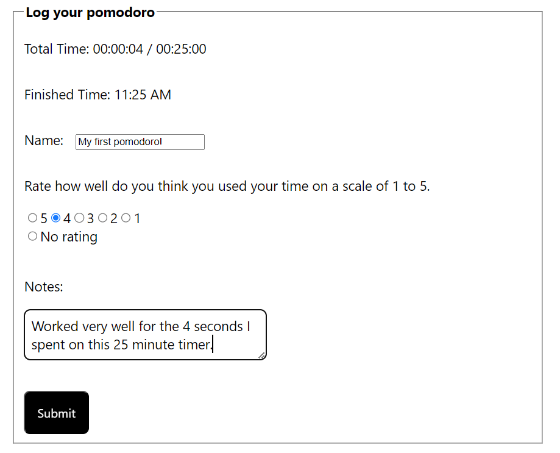
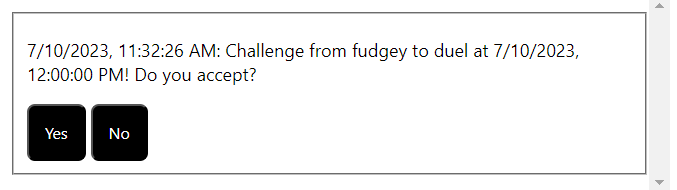

# PomoDuel

An application designed for users to track and "duel" their own pomodoros against each other, designed with React, JavaScript, and HTML/CSS.

## Status + Link

As of this writing, PomoDuel has been released and is being hosted online at pomoduel.appspot.com.

## Screenshots

## Installation

Clone this repository. You will need node and npm installed globally on your machine.

To Install:
Run "npm install"

To Start Server
Run "npm run dev" in pomoduel-backend.

To Visit App:
Go to localhost:8000.

## Approach + Technologies

This was a month-long side project built between my second and third year at San Jose State University. It was made to help familiarize myself with React, JavaScript, and HTML/CSS.

The original idea was to build an application that would solely help users track pomodoros, and add a score mechanism to the app that would incentivize users to keep working. However, as development progressed, I came up with the idea of competing pomodoros against other users who might be working at the same time.

One of the biggest challenges I ran into were the multiple databases and hosting applications PomoDuel had to communicate with in order to function. Coordinating Google Cloud, Firebase, and MongoDB proved to be challenging. I had to create several test users in an effort to get them to communicate with the server, the online databases, and each other.

Technologies used include React, React Router 6.11.2, Express 4.18.2, MongoDB 5.6.0, and Firebase 9.22.2. The general infrastructure of the app was developed with the help of the "React: Creating and Hosting a Full-Stack Site" video course on LinkedIn Learning taught by Shaun Wassell, although much has been changed from the general template (which was for a blog site) to this application. The original boilerplate was supplied by create-react-app to cut down on initial setup.

## Credits

PomoDuel was solely developed by Dylan Huang. Visit my GitHub at https://github.com/huang-dylan and my LinkedIn at https://www.linkedin.com/in/huang-dylan/.
